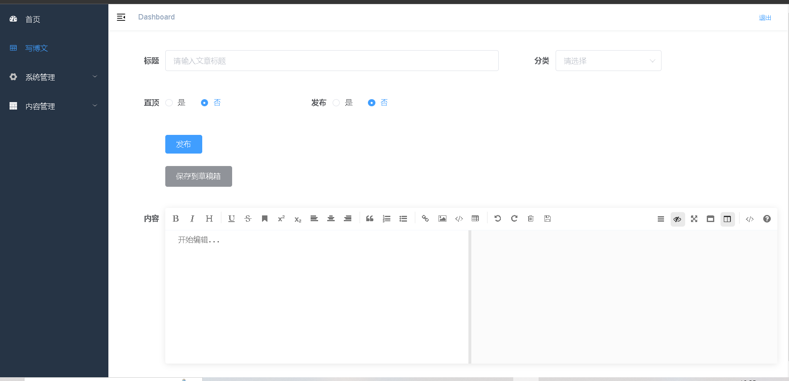

# roberBlog

基于Vue-Springboot的前后端分离博客系统

使用后台前端解决方案[vue-element-admin](https://github.com/PanJiaChen/vue-element-admin)


# 技术选型

- **后端技术栈**
  - springboot
  - mybaits
  - jwt

- **数据库**
  - mysql
- **前端技术**
  - vue
  - element-ui
- **中间件技术**
  - redis
- **安全管理技术**
  - springSecurity
- **运维技术**
  - centos
  - docker
  - nginx
  - maven


#  功能简介
   - 基于RBAC的权限管理
   - 基于redis的实时访问量刷新
   - 文章,标签的增删改查
   - 基于SpringSecurity的登录验证
   

#  项目结构

```c++
│  Deployment Descriptor.md      //部署文档
│  LICENSE.txt   
│  README.md 
│  images
│   
├─前端
│  ├─admin-vue                  //前台代码         
│  └─blog-vue                   //后台代码
│                  
└─后端
    └─robertBlog                //采用多模块架构  
        ├─admin                 //前端代码
        ├─blog                  //后端代码
        └─framework
```

​        

# 部署教程

详见Deployment Descriptor.md

# 效果预览

**博客前端首页**


**文章详情页**


**博客后端首页**


**写博文页**



**文章管理页**


**分类管理页**


# 赞助


你可以通过下方二维码赞助本项目

   


 


